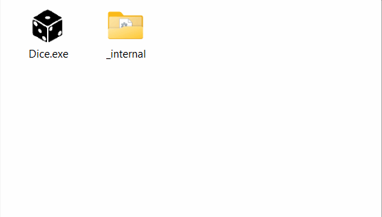

# About the project
A simple dice game project in Python.

## Example of the app working
An example of the app working is demonstrated in a gif animation:

## Launching the game
To run the game on your computer, download the repository and run the `Dice.exe` file (note that the `Dice.exe` file must be located within the `_internal` folder).

## Backend
The game implementation code is located in the `backend` folder and is in two files: `main.py` and `settings.py`. The file with the `.exe` extension was created using the `pyinstaller` library.